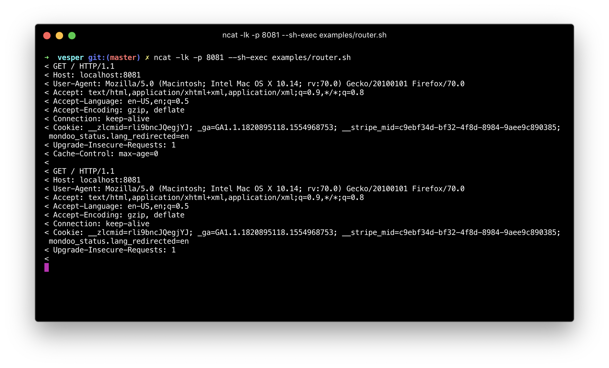
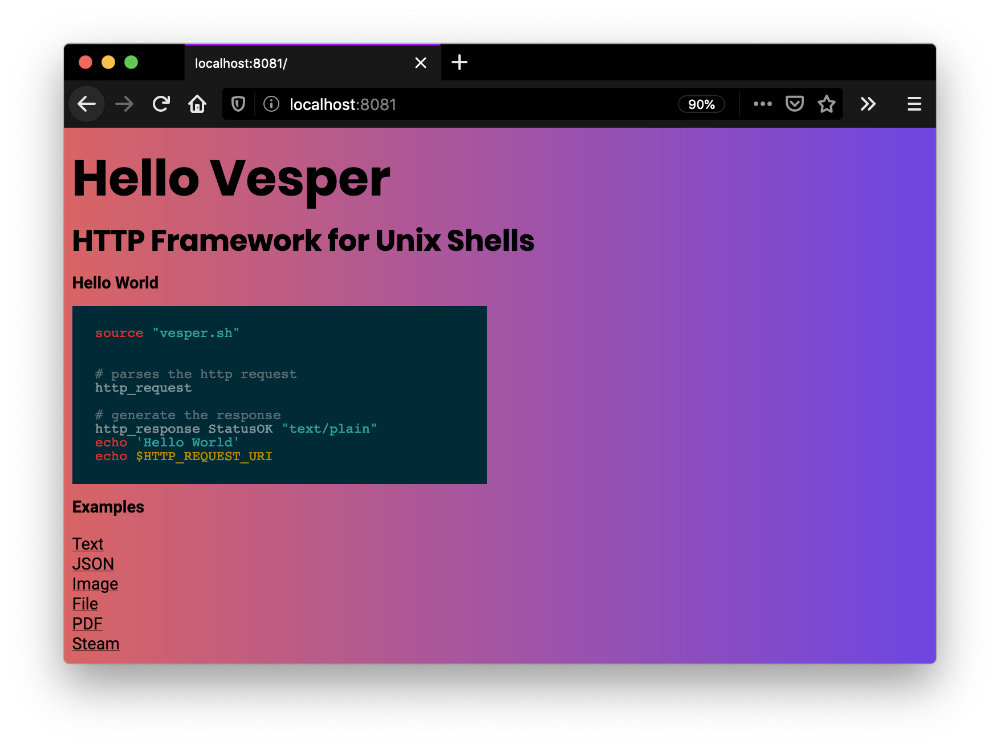

# Vesper - HTTP Framework for Unix Shell


`vesper` is a collection of shell functions to make it super easy to generate valid http responses. Vesper is not a web server itself, its just the framework to parse http requests and generate valid responses.

## This is craszy, who needs a http framework for unix shells?

That is a very good question! If you would have asked me that question a year ago, I would have argued: nobody. Now, I am not sure anymore. How will sh/bash scripts work in the future of cloud and serverless. Should we even do it?

## Get Started

**Hello World**

```
source "vesper.sh"

# parses the http request
http_request

# generate the response
http_response StatusOK "text/plain"
echo 'Hello World'
echo $HTTP_REQUEST_URI
```

Start the server

```
ncat -lk -p 8081 --sh-exec examples/router.sh
```

## Examples

 * [Text](./examples/helloworld.sh)
 * [JSON](./examples/json.sh)
 * [PDF](./examples/pdf.sh)
 * [Image](./examples/image.sh)
 * [File Stream](./examples/file_stream.sh)
 * [Router](./examples/router.sh)

To see all the examples in place justs run:

Start the server

```
# download the test pdf
wget http://tiswww.case.edu/php/chet/bash/rose94.pdf

# start the server
ncat -lk -p 8081 --sh-exec ./examples/router.sh
```



Visit the url localhost:8081



## Dependencies

- `ncat` - used to execute the bash scripts on incoming requests
- `cat` - used to pipe file content
- `file` - used to determine the mime type
- `stat` -  used to determine the file size

**Debian**

```bash
apt-get install ncat
apt-get install file
```

**Centos**

```bash
yum install nmap
yum install file
```

**Mac**

```bash
brew install nmap
```

## FAQ

**Why is the project named vesper?**

Popular web frameworks like [martini](https://github.com/go-martini/martini) and [gin](https://github.com/gin-gonic/gin) are named after cocktails and one of James Bond's famous cocktails is called vesper.

**Is vesper production ready?**

Its build on tooling that is around for decades. The foundation is battle-tested. While this is the caae, its not designed for web-scale workloads.

**Should I switch from my popular http framework X to vesper?**

Most likely not

**Are there limitations**

At this point, its only tested with http GET methods

## Open questions

* What is the best way to handle execution errors?
* What is the stable way to verify http query params?
